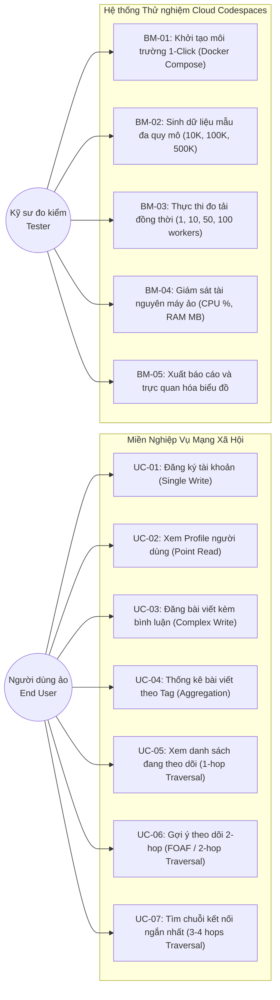
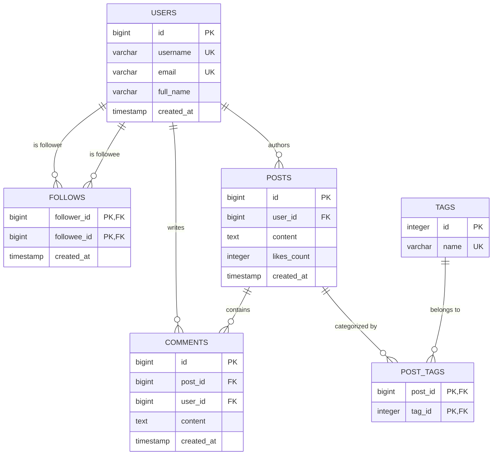
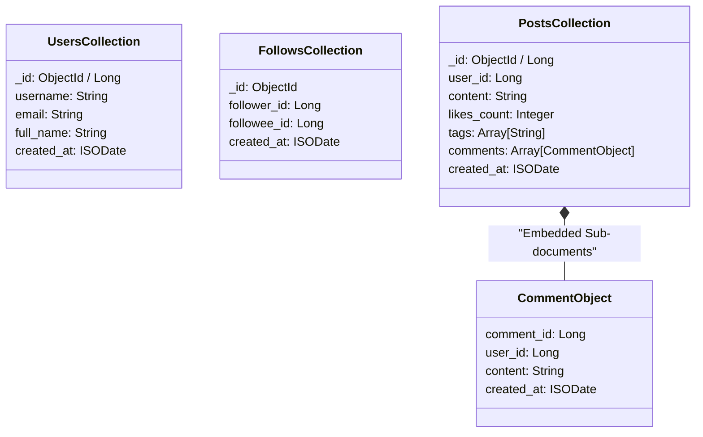

# 📐 TÀI LIỆU THIẾT KẾ ĐẶC TẢ NGHIỆP VỤ, USE CASE VÀ MÔ HÌNH DỮ LIỆU ĐỒNG NHẤT

> **Đề tài:** Nghiên cứu, đánh giá hiệu năng các mô hình cơ sở dữ liệu quan hệ, phi quan hệ và đồ thị trên môi trường phát triển ảo hóa Cloud-based (GitHub Codespaces)  
> **Ngành:** Kỹ thuật Phần mềm - Trường Đại học Phenikaa  
> **Mã task:** Task 2.1, 2.2, 2.3, 2.4, 2.5 (TODO.md)  
> **Vị trí lưu trữ:** `C:\Users\ADMIN\Desktop\cloud-db-benchmark\THIET_KE_CSDL_VA_USECASE.md`

---

## 1. MÔ TẢ MIỀN NGHIỆP VỤ (DOMAIN SPECIFICATION)

Bài toán thực nghiệm được lựa chọn là **Hệ thống Mạng xã hội & Tương tác Nội dung (Social Network & Content Platform)** với các quy tắc nghiệp vụ (Business Rules) chuẩn hóa sau:

1. **Người dùng (Users):** Mỗi người dùng sở hữu một định danh duy nhất (`id`), tên đăng nhập (`username`), địa chỉ email (`email`), họ tên hiển thị (`full_name`) và thời gian gia nhập (`created_at`).
2. **Quan hệ Theo dõi (Follows - Đồ thị có hướng):** 
   - Người dùng $A$ có thể theo dõi người dùng $B$ (`follower_id` $\rightarrow$ `followee_id`).
   - Mối quan hệ có tính một chiều (Directed). Nếu cả hai cùng theo dõi nhau, hệ thống ghi nhận là quan hệ bạn bè đối ứng (Mutual Followers).
3. **Bài viết & Tương tác (Posts):**
   - Người dùng có thể đăng tải các bài viết (`Post`). Mỗi bài viết có định danh, nội dung (`content`), thời điểm đăng và lượt thích (`likes_count`).
   - Bài viết được gắn với một hoặc nhiều Thẻ chủ đề (`Tags`).
4. **Bình luận (Comments):**
   - Người dùng có thể để lại bình luận dưới bài viết. Mỗi bình luận ghi nhận người viết (`user_id`), nội dung bình luận (`content`) và thời điểm tạo.
5. **Thẻ chủ đề (Tags / Topics):**
   - Là một thực thể độc lập (`id`, `name`) dùng để phân loại nội dung bài viết và mô hình hóa sở thích người dùng.

---

## 2. BIỂU ĐỒ VÀ ĐẶC TẢ CA SỬ DỤNG (USE CASE MODELING)

### 2.1. Biểu đồ Ca sử dụng Tổng quan (UML Use Case Diagram)



---

### 2.2. Ma trận Truy vết (Traceability Matrix): Ánh xạ Use Case sang CSDL

Bảng dưới đây là căn cứ khoa học chứng minh nguồn gốc của mọi câu truy vấn benchmark:

| Mã UC | Tên Ca Sử Dụng | Loại Thao Tác | PostgreSQL (SQL) | MongoDB (MQL) | Neo4j (Cypher) | Chỉ số đo |
| :---: | :--- | :--- | :--- | :--- | :--- | :--- |
| **UC-01** | Đăng ký tài khoản | Single Insert | `INSERT INTO users ...` | `db.users.insertOne(...)` | `CREATE (u:User ...)` | Latency, Write QPS |
| **UC-02** | Xem trang cá nhân | Point Read | `SELECT * FROM users WHERE id = ?` | `db.users.findOne({_id: ?})` | `MATCH (u:User {id: ?}) RETURN u` | Read Latency, QPS |
| **UC-03** | Đọc bài viết + Bình luận | Read with Join / Embedded | `SELECT * FROM posts p JOIN comments c ON p.id = c.post_id WHERE p.id = ?` | `db.posts.findOne({_id: ?})` *(Đọc 1 lần vì comments đã nhúng)* | `MATCH (p:Post {id: ?}) OPTIONAL MATCH (c:Comment)-[:COMMENTED_ON]->(p) RETURN p, c` | Throughput, Disk I/O |
| **UC-04** | Thống kê Post theo Tag | Aggregation / Group By | `SELECT t.name, COUNT(pt.post_id) FROM tags t JOIN post_tags pt ... GROUP BY t.name` | `db.posts.aggregate([{$unwind: "$tags"}, {$group: {_id: "$tags", count: {$sum: 1}}}])` | `MATCH (t:Tag)<-[:TAGGED_WITH]-(p:Post) RETURN t.name, count(p)` | Latency, CPU % |
| **UC-05** | Xem ai đang Follow | 1-hop Traversal | `SELECT followee_id FROM follows WHERE follower_id = ?` | `db.follows.find({follower_id: ?})` | `MATCH (u:User {id: ?})-[:FOLLOWS]->(f:User) RETURN f` | Latency (ms) |
| **UC-06** | Gợi ý người theo dõi (2-hop) | 2-hop Traversal / FOAF | `SELECT f2.followee_id FROM follows f1 JOIN follows f2 ON f1.followee_id = f2.follower_id WHERE f1.follower_id = ?` | `db.follows.aggregate([{$match: {follower_id: ?}}, {$graphLookup: {from: "follows", startWith: "$followee_id", connectFromField: "followee_id", connectToField: "follower_id", as: "foaf", maxDepth: 1}}])` | `MATCH (u:User {id: ?})-[:FOLLOWS]->()-[:FOLLOWS]->(foaf:User) WHERE NOT (u)-[:FOLLOWS]->(foaf) AND u <> foaf RETURN foaf, count(*) ORDER BY count(*) DESC LIMIT 10` | Latency, RAM MB |
| **UC-07** | Tìm chuỗi kết nối ngắn nhất | Deep Traversal (Shortest Path) | `WITH RECURSIVE path_cte AS (...)` *(Đệ quy nối bảng)* | `$graphLookup` với `maxDepth: 3` | `MATCH p = shortestPath((u1:User {id: ?})-[:FOLLOWS*..4]->(u2:User {id: ?})) RETURN p` | Latency, OOM risk |

---

## 3. THIẾT KẾ MÔ HÌNH DỮ LIỆU ĐỒNG NHẤT (3 PARADIGMS)

### 3.1. Mô hình Quan hệ (PostgreSQL 16 - Relational Model)
Chuẩn hóa mức 3NF (Third Normal Form), toàn vẹn dữ liệu chặt chẽ qua ràng buộc Khóa chính và Khóa ngoại:



---

### 3.2. Mô hình Hướng tài liệu (MongoDB 7.0 - Document Model)
Tuân theo nguyên tắc thiết kế tự nhiên của NoSQL Document:
- Nhúng (`Embedding`) mảng các bình luận gần nhất (`comments`) và danh sách thẻ (`tags`) trực tiếp vào tài liệu `posts` để tối ưu thao tác đọc bài viết kèm bình luận trong 1 truy vấn đơn lẻ.
- Tách riêng `users` và `follows` để hỗ trợ truy vấn quan hệ và lập chỉ mục hiệu quả.



---

### 3.3. Mô hình Đồ thị Thuộc tính (Neo4j 5.x - Property Graph Model)
Tách biệt triệt để Đỉnh (Nodes) và Cạnh liên kết (Relationships). Mọi liên kết đều được lưu trữ trực tiếp bằng con trỏ bộ nhớ hai chiều (*Index-free Adjacency*):

```mermaid
graph LR
    User1["(:User {id, username, email})"]
    User2["(:User {id, username, email})"]
    Post["(:Post {id, content, created_at, likes_count})"]
    Tag["(:Tag {id, name})"]

    User1 -->|[:FOLLOWS {created_at}]| User2
    User1 -->|[:CREATED]| Post
    User2 -->|[:COMMENTED {id, content, created_at}]| Post
    Post -->|[:TAGGED_WITH]| Tag
```

---

## 4. CHIẾN LƯỢC ĐÁNH CHỈ MỤC ĐỒNG BỘ (INDEXING STRATEGY)

Để đảm bảo tính công bằng tuyệt đối khi đo đạc, tất cả các trường được sử dụng trong mệnh đề tìm kiếm (`WHERE`, `$match`, `MATCH`) đều được lập chỉ mục tương đương:

| Thao tác / Trường | PostgreSQL 16 | MongoDB 7.0 | Neo4j 5.x |
| :--- | :--- | :--- | :--- |
| **Tìm theo User ID** | Khóa chính B-Tree (`PRIMARY KEY`) | `_id` mặc định có Unique Index | `CREATE CONSTRAINT ... REQUIRE u.id IS UNIQUE` |
| **Tìm theo Username** | B-Tree Index: `CREATE UNIQUE INDEX ...` | Unique Index: `{username: 1}, {unique: true}` | Schema Index: `CREATE INDEX FOR (u:User) ON (u.username)` |
| **Tìm quan hệ Follows** | Composite Index: `(follower_id, followee_id)` và `(followee_id)` | Compound Index: `{follower_id: 1, followee_id: 1}` | Native Adjacency List (Tự động lập chỉ mục cạnh theo nút) |
| **Tìm Post theo User** | B-Tree Index trên `posts(user_id)` | Single Field Index: `{user_id: 1}` | Relationship traversal từ `(:User)-[:CREATED]->(:Post)` |
| **Lọc theo Tag** | Index trên `post_tags(tag_id)` | **Multikey Index** trên `posts.tags` | Schema Index: `CREATE INDEX FOR (t:Tag) ON (t.name)` |
