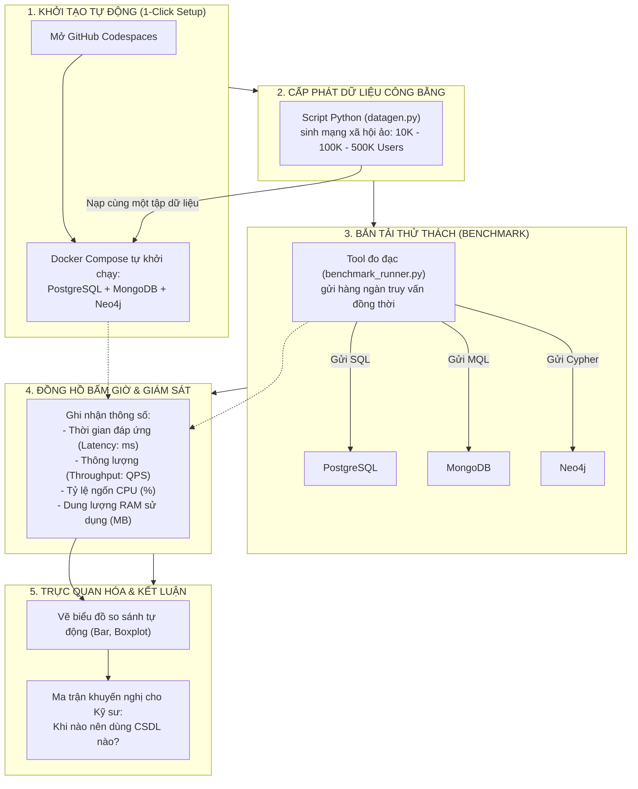

# 📖 TỔNG QUAN VÀ BẢN CHẤT DỰ ÁN (PROJECT EXPLANATION)

> **Đề tài:** Nghiên cứu, đánh giá hiệu năng các mô hình cơ sở dữ liệu quan hệ, phi quan hệ và đồ thị trên môi trường phát triển ảo hóa Cloud-based (GitHub Codespaces)  
> **Ngành:** Kỹ thuật Phần mềm - Trường Đại học Phenikaa  
> **Vị trí lưu trữ:** `C:\Users\ADMIN\Desktop\cloud-db-benchmark\explain.md`

---

## 1. DỰ ÁN NÀY LÀ GÌ? (BẢN CHẤT DỰ ÁN)

Trong ngành Kỹ thuật Phần mềm, khi xây dựng một hệ thống (như mạng xã hội, sàn thương mại điện tử, ứng dụng tài chính), các kỹ sư luôn phải đối mặt với câu hỏi kiến trúc cốt lõi: **"Hệ thống này nên sử dụng hệ quản trị CSDL nào để đạt hiệu năng tối ưu nhất?"**
- Dùng SQL quan hệ truyền thống (PostgreSQL)?
- Dùng NoSQL lưu dạng tài liệu linh hoạt (MongoDB)?
- Hay dùng CSDL đồ thị chuyên biệt (Neo4j)?

Đa số sinh viên hoặc kỹ sư thường lựa chọn theo cảm tính hoặc thói quen cá nhân. **Đề tài này được thực hiện nhằm trả lời câu hỏi đó bằng số liệu thực nghiệm khoa học, chính xác và có thể kiểm chứng.**

---

### Ba "thí sinh" đại diện cho 3 trường phái CSDL:

1. **PostgreSQL 16 (Mô hình Quan hệ - RDBMS):**
   - *Cách tổ chức:* Dữ liệu lưu dưới dạng các bảng nghiêm ngặt (dòng và cột).
   - *Bản chất kỹ thuật:* Sử dụng cấu trúc cây B-Tree để lập chỉ mục, liên kết các thực thể thông qua khóa chính (`Primary Key`) và khóa ngoại (`Foreign Key`), kết nối dữ liệu bằng các phép nối bảng (`JOIN`). Đảm bảo toàn vẹn giao dịch theo chuẩn ACID.
2. **MongoDB 7.0 (Mô hình Hướng tài liệu - Document NoSQL):**
   - *Cách tổ chức:* Dữ liệu lưu dưới dạng các tệp hồ sơ nhúng BSON (Binary JSON).
   - *Bản chất kỹ thuật:* Không bắt buộc schema cố định (Schema-less), cho phép nhúng (embed) các thông tin liên quan (ví dụ: bài viết kèm danh sách bình luận) vào chung một document duy nhất. Tối ưu cho tốc độ đọc/ghi tài liệu nhanh và mở rộng ngang.
3. **Neo4j 5.x (Mô hình Đồ thị - Graph Database):**
   - *Cách tổ chức:* Dữ liệu lưu dưới dạng mạng lưới gồm các Đỉnh (Nodes) và Cạnh liên kết (Edges/Relationships).
   - *Bản chất kỹ thuật:* Ứng dụng cơ chế **Index-free Adjacency** (kề nhau không cần chỉ mục). Mỗi đỉnh lưu trữ trực tiếp con trỏ bộ nhớ trỏ sang các đỉnh lân cận, cho phép duyệt qua hàng triệu mối quan hệ (như bạn của bạn, chuỗi liên kết) với tốc độ gần như tức thì mà không phải quét bảng hay nối bảng.

---

### "Sân vận động thi đấu": Nền tảng ảo hóa GitHub Codespaces
Nếu thực nghiệm đo đạc trên máy tính cá nhân (laptop), kết quả sẽ bị sai lệch và thiếu khách quan (do cấu hình máy mỗi người khác nhau, hệ điều hành khác nhau, có ứng dụng chạy nền ngốn RAM/CPU).
- Đề tài sử dụng **GitHub Codespaces**: Một máy ảo Linux được đóng gói chuẩn hóa trên nền tảng đám mây của GitHub thông qua công nghệ **Dev Containers** và **Docker Compose**.
- **Tính năng nổi bật:** Bất kỳ ai (kể cả Giảng viên chấm thi) chỉ cần mở link GitHub và click chuột **"Create codespace"** là toàn bộ môi trường với đúng thông số vCPU/RAM cố định và 3 CSDL sẽ tự động khởi chạy đồng thời (**Tính khoa học & Tính tái lập - Reproducibility**).

---

## 2. DỰ ÁN HOẠT ĐỘNG NHƯ THẾ NÀO? (LUỒNG VẬN HÀNH KHÉP KÍN)

Hệ thống vận hành theo chu trình tự động 5 bước khép kín:

---

## 3. "CUỘC ĐUA" DIỄN RA TRÊN NHỮNG BÀI TOÁN GÌ?

Cả 3 CSDL sẽ cùng xử lý các kịch bản thực tế của bài toán **Mạng xã hội**:

### Kịch bản 1: Xem thông tin cá nhân & Đăng bài (CRUD cơ bản)
- *Bài toán:* Thao tác đọc và ghi bản ghi đơn lẻ theo ID.
- *Bản chất:* Đánh giá chi phí overhead của hệ thống khi ghi dữ liệu có ràng buộc toàn vẹn (Postgres) so với ghi tài liệu linh hoạt (Mongo) và tạo node/edge (Neo4j).

### Kịch bản 2: Thống kê & Phân tích dữ liệu (Aggregation & Filtering)
- *Bài toán:* Đếm số bài viết theo chủ đề `#congnghe`, thống kê top người dùng hoạt động tích cực trong tháng.
- *Bản chất:* Đánh giá khả năng quét chỉ mục (Index scan), tính toán gom nhóm dữ liệu của SQL Group By so với MongoDB Aggregation Pipeline.

### Kịch bản 3: Gợi ý bạn bè & Tìm chuỗi liên kết (Truy vấn đồ thị - Trọng tâm đề tài)
- *Bài toán:* Tìm danh sách "Bạn của bạn" (2-hop), tìm bạn chung, tìm chuỗi kết nối ngắn nhất giữa 2 người xa lạ (3-hop, 4-hop).
- *Cách xử lý của từng CSDL:*
  - **PostgreSQL:** Phải tự `JOIN` bảng quan hệ lặp đi lặp lại nhiều lần. Khi dữ liệu lớn, chi phí bộ nhớ cho các phép JOIN đệ quy tăng theo cấp số nhân, dễ gây nghẽn tài nguyên.
  - **MongoDB:** Phải sử dụng toán tử `$graphLookup` để quét đệ quy qua các collection; hiệu năng suy giảm nhanh khi độ sâu tăng.
  - **Neo4j:** Tận dụng triệt để cơ chế *Index-free Adjacency*, chỉ việc men theo con trỏ mũi tên để nhảy giữa các đỉnh mà không cần quét bảng. Tốc độ vượt trội áp đảo ở các tầng liên kết sâu.

---

## 4. KẾT QUẢ ĐẦU RA CỦA ĐỒ ÁN (DELIVERABLES)

Khi hoàn thành dự án, bạn sẽ có đầy đủ:
1. **Một GitHub Repository chuẩn Cloud-native:**
   - Đóng gói hoàn chỉnh với Docker Compose & Dev Container.
   - Bất kỳ ai cũng có thể bấm nút **"Open in GitHub Codespaces"** để demo trực tiếp toàn bộ hệ thống trên trình duyệt.
2. **Cuốn Báo cáo Đồ án Chuyên ngành chuẩn Phenikaa (5 chương):**
   - Đầy đủ lý thuyết, phân tích Use Case, mô hình kiến trúc, quy trình thực nghiệm và các biểu đồ phân tích số liệu đạt độ phân giải cao (300 DPI).
3. **Bảng Ma trận Quyết định Kỹ thuật (Database Decision Matrix):**
   - Tài liệu đúc kết thực tiễn cho kỹ sư phần mềm: Khi nào nên dùng PostgreSQL, khi nào chọn MongoDB, và bài toán nào bắt buộc phải đưa lên Neo4j.
